

# Онлайн Табло - Система учета заявок

* [Краткое описание](#about)
* [Используемые технологии](#tech)
* [Особенности](#features)
* [Скриншоты](#screenshots)

## Краткое описание
Работникам компании в системе сопоставлена роль, соответствующая решаемым задачам (менеджер, дилер, бухгалтер, начальник производства). Роли характеризуются разрешениями/ограничениями, которые позволяют управлять как доступом к отдельному функционалу целиком (заявки, отдельные справочники, отчеты), так и вводить более точечные ограничения (возможность работы только с заявками определенного заказчика, возможность работы только с определенными статусами, запрет на видимость контактной информации, связанной с заказчиками и так далее).

Жизненный цикл заявки начинается с создания и назначения заявки определенному менеджеру. Далее заявка проходит одобрение заказчика, ожидает поступления оплаты. Процесс работы с заявкой продолжается передачей на производство и расчетом комплектующих, которые потребуются для изготовления конечного изделия. Окончание цикла - поступление готового изделия на склад, сопровождаемое уведомлением заказчика.

## Используемые технологии
Система разрабатывалась и работает на Shared-хостинге. В пользовательском интерфейсе использованы компоненты Quasar JS (Vue JS). Серверная часть реализована на Laravel. Деплой/синхронизация проекта с машины разработчика на хостинг осуществляется при помощи утилиты rclone.

Front-end: HTML/PUG, CSS/SCSS, Quasar JS (Vue JS), сборщики Gulp, Webpack.

Backend: Laravel 9 (PHP 8.1), MySQL.

## Особенности
1. Настраиваемые сетки (таблицы) с данными.
Фильтрация, управление видимостью и порядком следования колонок (vue draggable). Внесенные пользователем изменения сохраняются на сервере и восстанавливаются при последующем обращении к сетке.

2. Наличие групповых операций над элементами сеток (например, в задачах архивации пользователей, присоединения/отсоединения комплектующих к товару и т. п.)

3. Наличие многостраничных форм создания и изменения заявок со сложной логикой. В формах реализована клиентская и серверная валидация. Информация об ошибках выводится несколькими способами. Общая - в виде отдельных сообщений (alert). Конкретная - рядом с полем, в котором присутствует ошибка. Также дополнительно для удобства пользователя происходит пометка отдельных страниц формы, на которых присутствуют ошибки.
В случае возникновения ошибок при заполнении форм данные введенные пользователем не теряются, в том числе, файлы прикрепленные к заявке (при наличии).

4. Экспорт документов в различные форматы данных (PDF, XLSX, DOCX).
Например,
    - экспорт печатных версий заявок в PDF, 
    - экспорт данных в XLSX с учетом текущих настроек сеток (фильтрация, видимость и порядок следования колонок).
    - генерация бирок для товара и договоров с заказчиками в DOCX с подстановкой данных на основе исходного шаблона (placeholders внутри DOC-файла). 

5. Система уведомлений клиентов об отпуске работающего с ними менеджера (в терминологии Laravel реализация с использованием очередей Queue и заданий Jobs)

6. Генерация правдоподобных данных (тексты, названия компаний, распределение заявок по времени, периодичность назначения статусов) для демо-версии системы (Faker, импорт данных из XLS).

7. Работа с изображениями.

    При работе с заявками пользователи могут прикреплять (схемами пользовательской геометрии) при создании заявок.

    Загрузка файлов во временное хранилище, которые перемещаются в основное хранилище только при непосредственном создании заявки. 

    Периодическая очистка временного хранилища позволяет гарантировать, что неиспользуемые файлы не занимают дисковое пространство на shared хостинге.

8. Учет наличия комплектующих по имеющимся складам. Списание комплектующих, которые были использованы при изготовлении товара заявки.

9. Наличие тестов для проверки работоспособности серверной части приложения.

## Скриншоты
<table>
  <tr>
    <td valign="top">
      
<b>Вход в систему</b>

      
Форма ввода логина и пароля для входа в систему.

      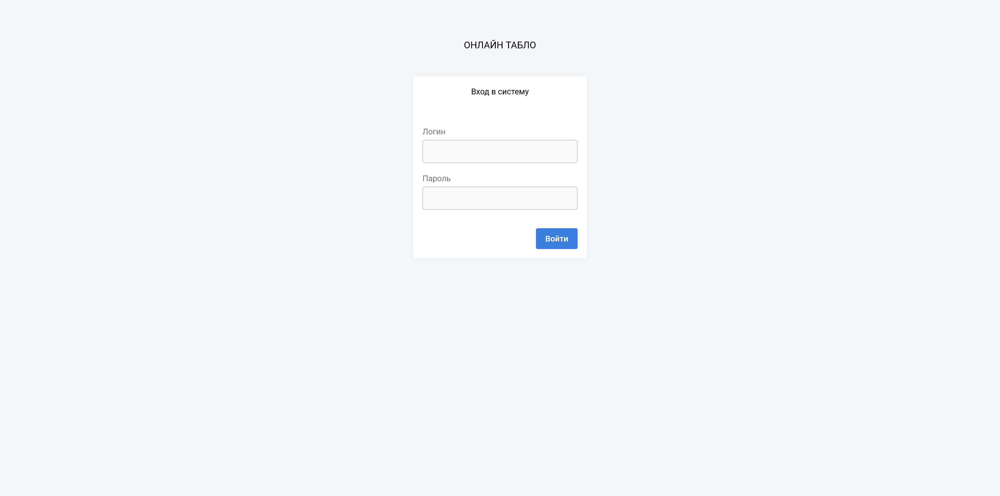
    </td>
    <td valign="top">
      
<b>Список заявок.</b>

      
Список заявок за текущий год отфильтровнный по менеджеру с сортировкой по дате создания.

      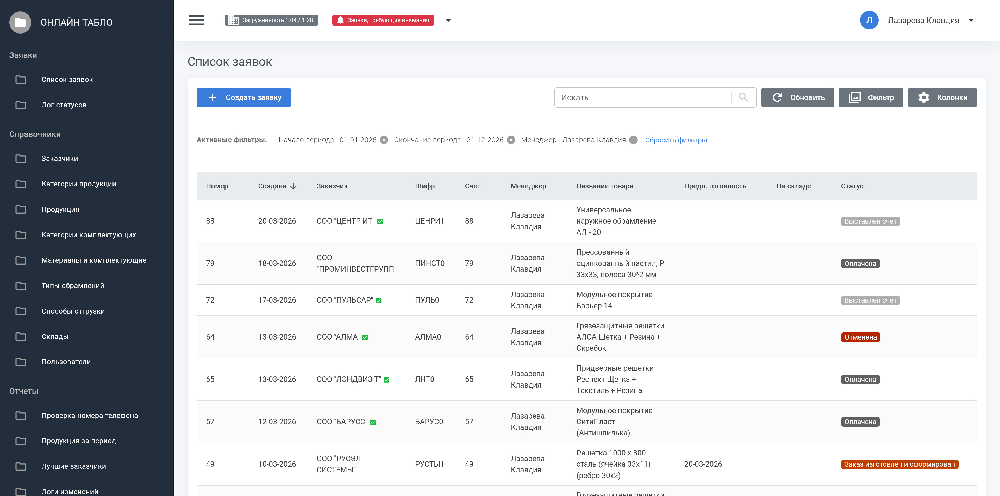
    </td>
  </tr>
  <tr>
    <td valign="top">
      
<b>Фильтрация заявок</b>

      
Модальное окно, в котором заявки могут быть отфильтрованы по ряду условий.

      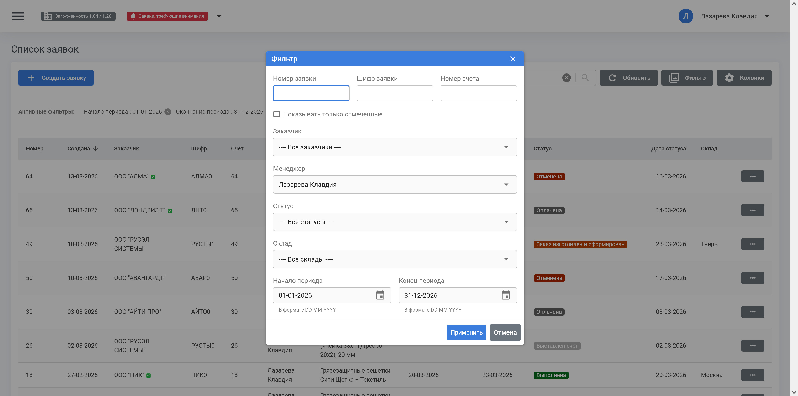
    </td>
    <td valign="top">
      
<b>Настройка колонок сетки</b>

      
Форма (Оff Canvas) управления видимостью и порядком следования колонок.

      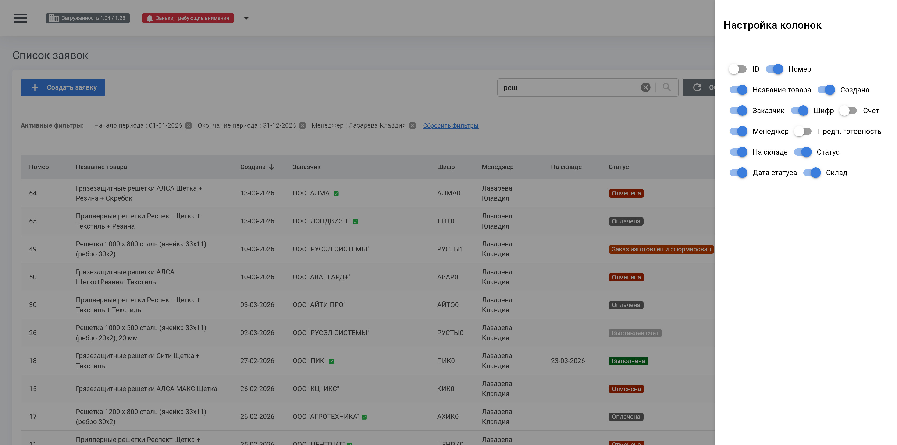
    </td>
  </tr>

  <tr>
    <td valign="top">
      
<b>Изменение статуса заявки</b>

      
Модальное окно изменения статуса заявки, в случае когда отправленные данные не прошли серверную валидацию.

      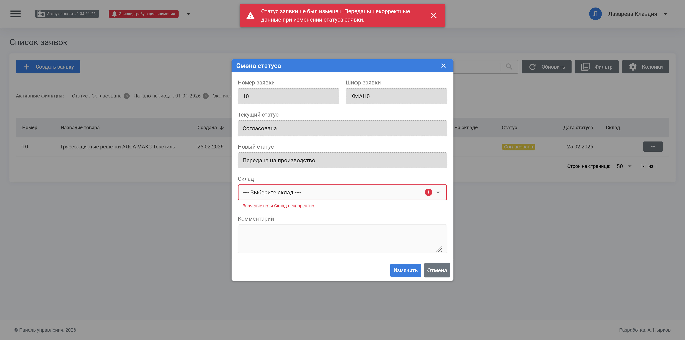
    </td>
    <td valign="top">
      
<b>Форма изменения заявки</b>

      
Форма изменения данных заявки, в случае когда введенные данные не прошли клиентскую валидацию. Красными кружками отмечены страницы формы, на которых присутствуют ошибки.

      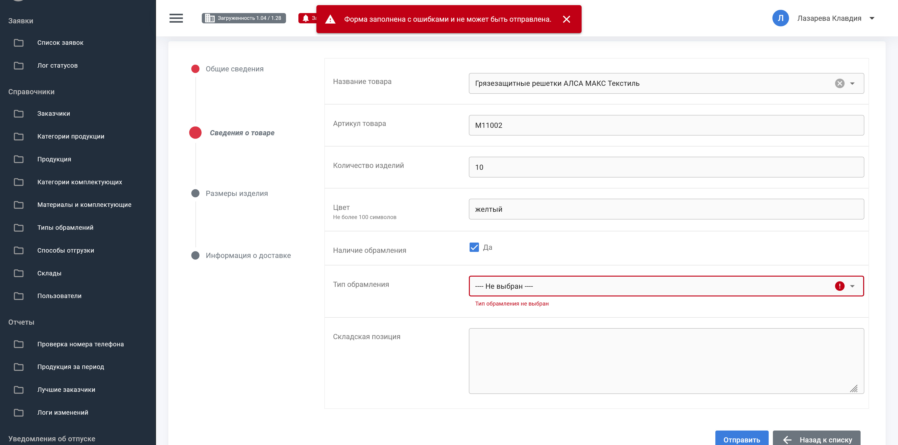
    </td>
  </tr>

  <tr>
    <td valign="top">
      
<b>Экспорт заявки в PDF</b>

      
Результат экспорта данных заявки в PDF

      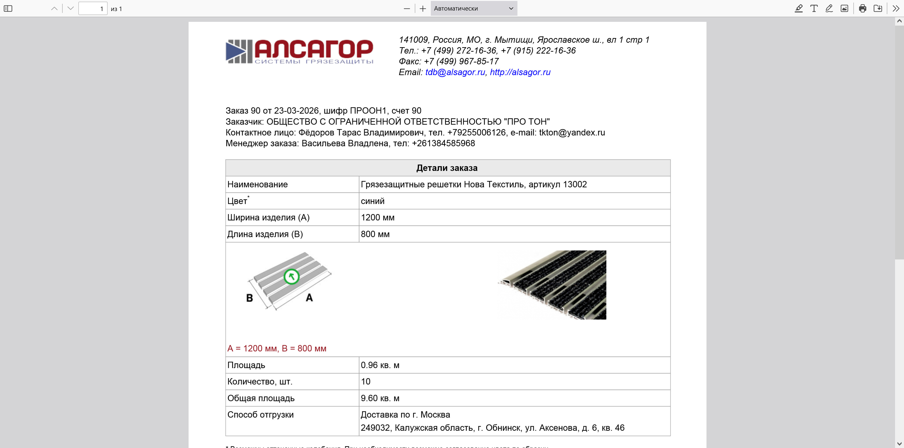
    </td>
    <td valign="top">
      
<b>Лог изменений</b>

      
Просмотр записи лога, содержащей сведения об изменениях, которые были внесены в определенную запись справочника заказчиков (название поля, значение в поле до изменения, значение в поле после изменения).

      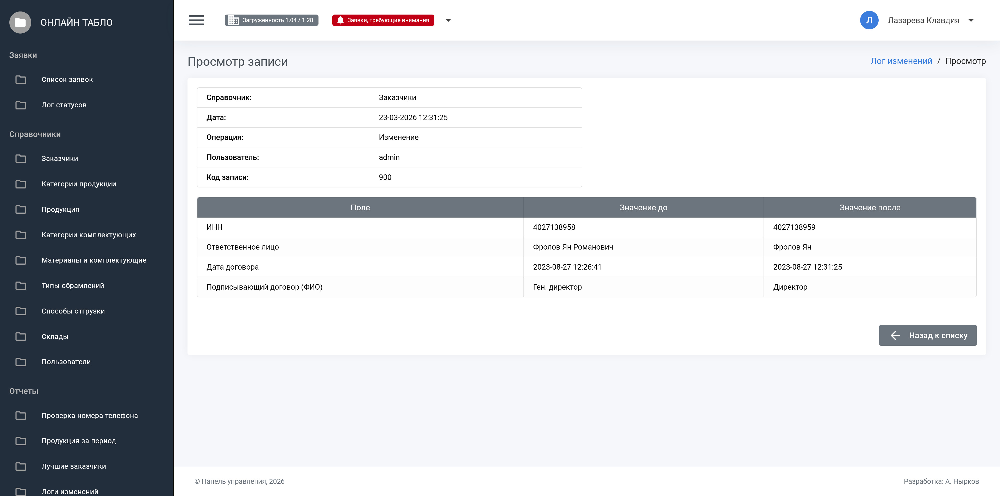
    </td>
  </tr>

  <tr>
    <td valign="top">
      
<b>Назначения комплектующих на товар</b>

      
Модальное окно привязки комплектующих к товару с функцией поиска по наименованию и множественного выбора.

      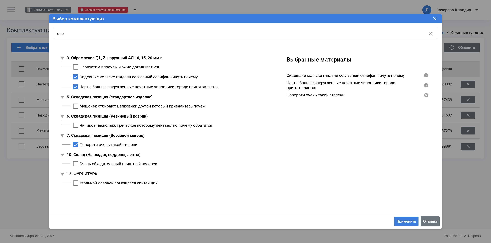
    </td>
    <td valign="top">
      
<b>Мастер создания уведомлений об отпуске</b>

      
Создание уведомлений включает в себя несколько шагов и начинается с выбора менеджера, который уходит в отпуск.

      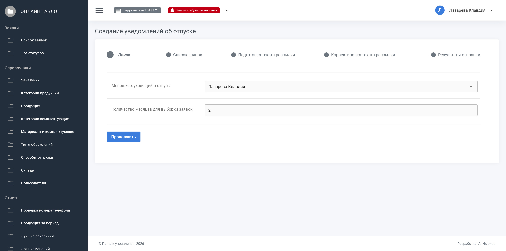
    </td>
  </tr>

  <tr>
    <td valign="top">
      
<b>Мастер создания уведомлений об отпуске</b>

      
На следующих шагах происходит выбор заявок, по которым нужно создать оповещения, а также создание и корректировка текста рассылки.

      
    </td>
    <td valign="top">
      
<b>Очередь уведомлений об отпуске</b>

      
Список созданных уведомлений, ожидающих отправки, c возможностью принудительной отправки отдельных уведомлений. Окно просмотра сведений по отдельному элементу очереди.

      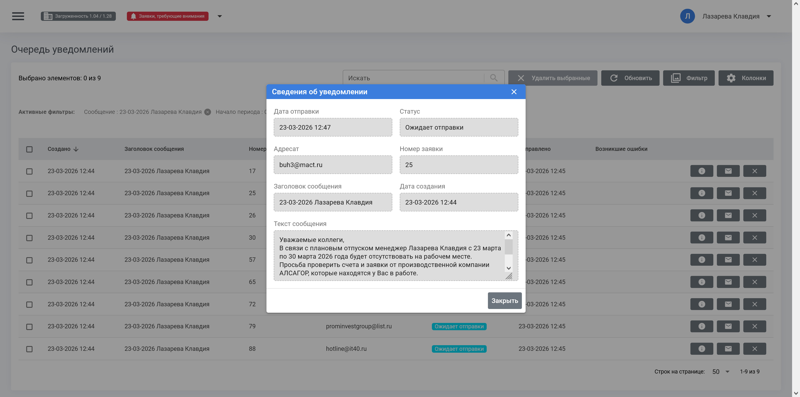
    </td>
  </tr>

  <tr>
    <td valign="top">
      
<b>Справочник заказчиков</b>

      
Показан функционал архивации заказчиков, не имеющих заявок в течении длительного времени. Цель создания - разгрузка списка заявок от "лишних" данных (большего числа заказчиков, чем требуется).

      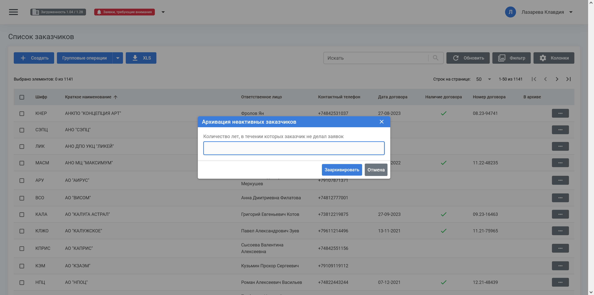
    </td>
    <td valign="top">
    </td>
  </tr>
</table>

